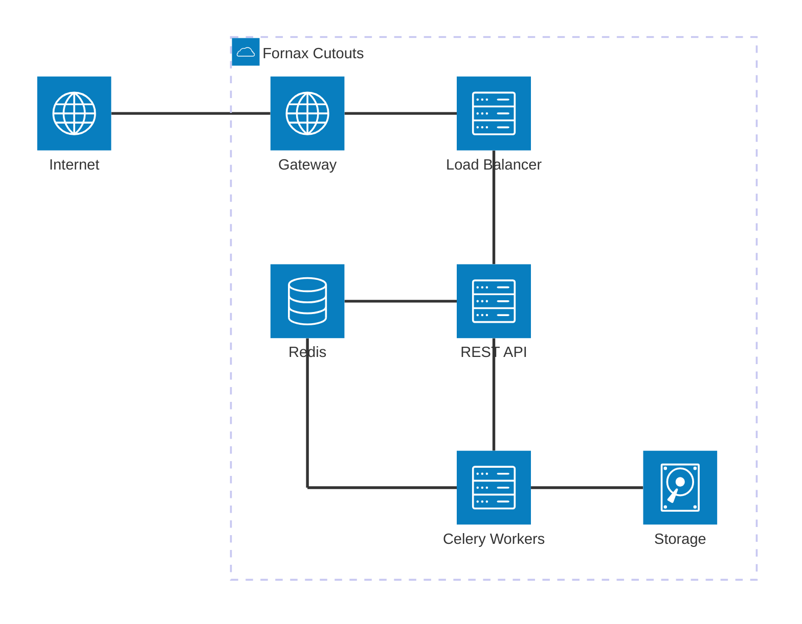

# Fornax Cutouts

## Infrastructure Architecture

```mermaid
architecture-beta
    service internet(internet)[Internet]


    group fornax(cloud)[Fornax Cutouts]

    service gateway(internet)[Gateway] in fornax
    service load_balancer(server)[Load Balancer] in fornax

    service api(server)[REST API] in fornax
    service worker(server)[Celery Workers] in fornax

    service redis(database)[Redis] in fornax
    service s3(disk)[Storage] in fornax

    internet:R -- L:gateway
    gateway:R -- L:load_balancer
    load_balancer:B -- T:api
    api:B -- T:worker

    junction j1 in fornax
    redis:B -- T:j1

    redis:R -- L:api
    j1:R -- L:worker

    s3:L -- R:worker
```
