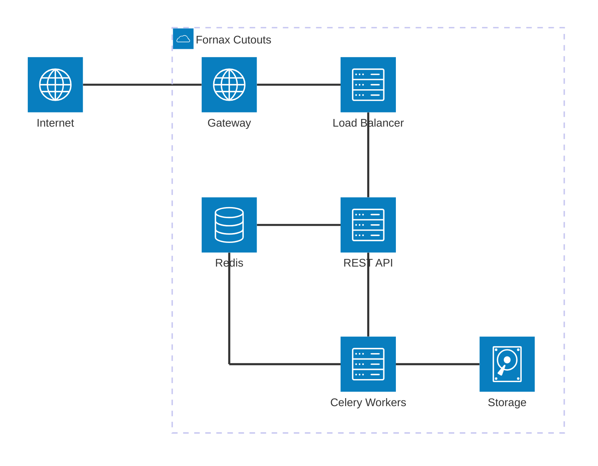

# Fornax Cutouts

Pluggable backend for async FITS image cutouts with [FastAPI](https://fastapi.tiangolo.com/) +
[Celery](https://docs.celeryq.dev/) + [Astrocut](https://github.com/spacetelescope/astrocut) using the
[IVOA UWS](https://www.ivoa.net/documents/UWS/) standard.

## Overview

Fornax Cutouts provides a framework for building astronomical image cutout services. Define mission-specific data
sources, register them with the cutout registry, and the framework handles job queuing, worker dispatch, result storage,
and REST API exposure automatically.

## Requirements

- **Python** 3.10, 3.11, 3.12, or 3.13
- **Redis** 6.x or newer — used as the Celery broker/backend and for UWS job state.

Configure the broker/backend with the following `CUTOUTS__REDIS__*` settings for local developmetn:

| Variable                  | Default     | Purpose                      |
| ------------------------- | ----------- | ---------------------------- |
| `CUTOUTS__REDIS__HOST`    | `localhost` | Redis hostname               |
| `CUTOUTS__REDIS__PORT`    | `6379`      | Redis port                   |
| `CUTOUTS__REDIS__TIMEOUT` | `15.0`      | Connection timeout (seconds) |

The API and workers must use the same Redis instance (and compatible TLS/cluster settings).
See the [configuration reference](https://nasa-fornax.github.io/fornax-cutouts/configuration)
for the full list of settings.

## Documentation

Full documentation is available at
**[nasa-fornax.github.io/fornax-cutouts](https://nasa-fornax.github.io/fornax-cutouts)**.

- [Getting Started](https://nasa-fornax.github.io/fornax-cutouts/getting-started)
- [Configuration](https://nasa-fornax.github.io/fornax-cutouts/configuration)
- [CLI Reference](https://nasa-fornax.github.io/fornax-cutouts/cli)
- [API Reference](https://nasa-fornax.github.io/fornax-cutouts/api)
- [Building a Source](https://nasa-fornax.github.io/fornax-cutouts/sources/building-a-source)

## Use as a library

Install this package in your own service and point `CUTOUTS__SOURCE_PATH` at a directory of mission modules
that register sources with `cutout_registry`.

With **uv**, you can add an editable path dependency if developing this project side by side with your mission sources:

```toml
[tool.uv.sources]
fornax-cutouts = { path = "../fornax-cutouts", editable = true }  # Only include if developing with fornax-cutouts source code

[project]
dependencies = [
    "fornax-cutouts",
]
```

Then run `uv sync`. Implement mission sources as described in
[Building a Source](https://nasa-fornax.github.io/fornax-cutouts/sources/building-a-source).

## Quick Start

```bash
# Install
git clone https://github.com/nasa-fornax/fornax-cutouts
cd fornax-cutouts
uv sync

# Configure (minimum required)
export CUTOUTS__SOURCE_PATH=/path/to/your/sources
export CUTOUTS__REDIS__HOST=localhost

# Start Redis
docker run -d -p 6379:6379 redis:7

# Start API
fornax-cutouts api

# Start worker (separate terminal)
fornax-cutouts worker
```

Visit `http://localhost:8000/docs` for the interactive API.

## Contributing

Pre-commit is configured to lint and format all code:

```bash
uv sync --group dev
pre-commit install
pre-commit run --all-files
```

## Infrastructure Architecture



## Issues

Report bugs and request features on [GitHub Issues](https://github.com/nasa-fornax/fornax-cutouts/issues).

## License

This project is licensed under the terms of the [BSD 3-Clause license](LICENSE).
