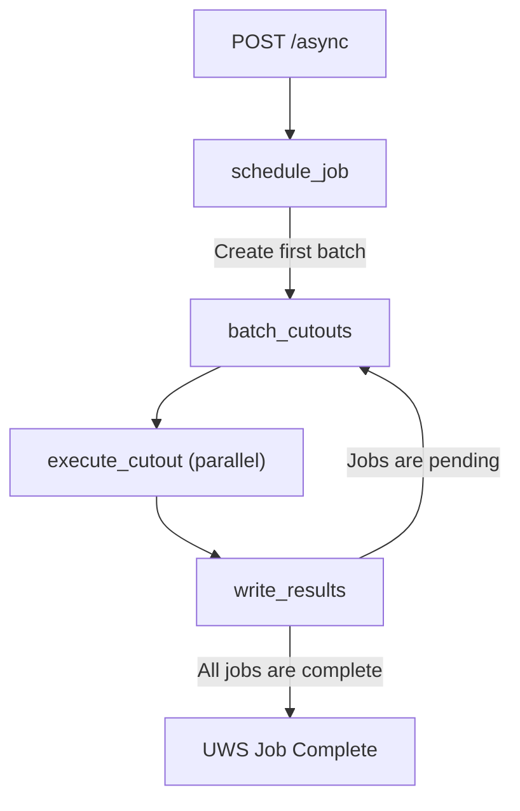
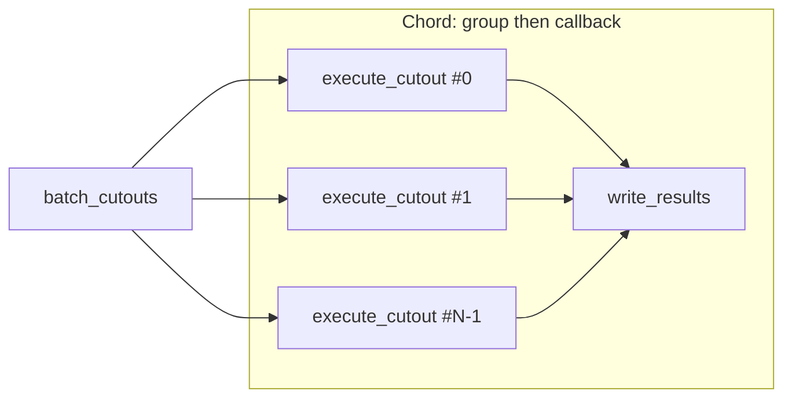

# Celery tasks and the async pipeline

When a client `POST`s to `/async`, the API creates a UWS job in Redis and immediately enqueues a **`schedule_job`** Celery task. Everything after that runs in workers: validation, batching, parallel cutouts, and writing results. The implementation lives in `fornax_cutouts/jobs/tasks.py`.

---

## Tasks and queues

| Task             | Celery queue | Role                                                                                                                                                                                                                                  |
| ---------------- | ------------ | ------------------------------------------------------------------------------------------------------------------------------------------------------------------------------------------------------------------------------------- |
| `schedule_job`   | `high_mem`   | Load job parameters from Redis, validate mission params, resolve sky positions to source files, push one **descriptor** per cutout into a Redis pending list, set UWS phase to `EXECUTING`, then start the first `batch_cutouts` run. |
| `batch_cutouts`  | `high_mem`   | Pop up to one batch of descriptors (size scales with `cutouts` worker pool and `batch_size_per_worker`), build a **chord** of `execute_cutout` signatures, and attach `write_results` as the chord callback.                          |
| `execute_cutout` | `cutouts`    | Run `generate_cutout` (astrocut + upload to storage), update Redis counters, return a `CutoutResponse` (or `None` on failure).                                                                                                        |
| `write_results`  | `high_mem`   | Receive the chord result list, append successful cutouts to Parquet via `CutoutResults`, then either mark the job **completed** or enqueue the next `batch_cutouts` if descriptors remain.                                            |

---

## What happens on job submission

1. **API** (`async_uws.post_job`) stores the given parameters and enqueues `schedule_job` to start the new UWS job. Setting the UWS job phase as `PENDING`.
2. **`schedule_job`** sets the UWS job phase as `QUEUED` then it will walks positions, resolving source image filenames through the source registry, validates the requested parameters, and then pushes job descriptors (source path, target, size, output paths, mission metadata) onto Redis for cutout work to begin. It then sets the UWS job phase as `EXECUTING`.
3. **`batch_cutouts`** pops a batch, increments batch number, and creates all `execute_cutout` tasks in that batch to run in parallel (subject to worker concurrency).
4. **`write_results`** will gather all results from the parallel `execute_cutout` tasks and write it to a parquet file within the job folder in storage for immediate retrieval by the user via the results endpoint. If pending descriptors remain, it schedules another **`batch_cutouts`** with the next batch id, going back to step 3; otherwise it sets UWS job phase as `COMPLETED`.

If there are no cutouts to run (zero source filename returns from the source registry), **`schedule_job`** completes the job immediately without starting `batch_cutouts`.

---

## Celery dependency graph

The important dependency pattern is the **chord**: many `execute_cutout` tasks have **no dependency on each other**, but **`write_results` depends on all of them** finishing for that batch. Across batches, **`batch_cutouts` and `write_results` alternate** until the pending queue is empty.

### End-to-end flow

### One batch: chord structure

In Celery terms this is `group(execute_cutout, …) | write_results` (a chord). The diagram shows the dependency edges Celery enforces.

---

## Related configuration

- **Batch sizing**: `batch_cutouts` uses `get_pool_size_for_queue("cutouts")` and `CONFIG.worker.batch_size_per_worker` to size each batch.
- **Queues**: Deployments typically run workers subscribed to both `high_mem` and `cutouts` (or route them as needed) so orchestration and CPU/I/O cutouts can scale independently.

See [Configuration](configuration.md) for worker-related environment variables and [Getting Started](getting-started.md) for running the API and workers locally.
