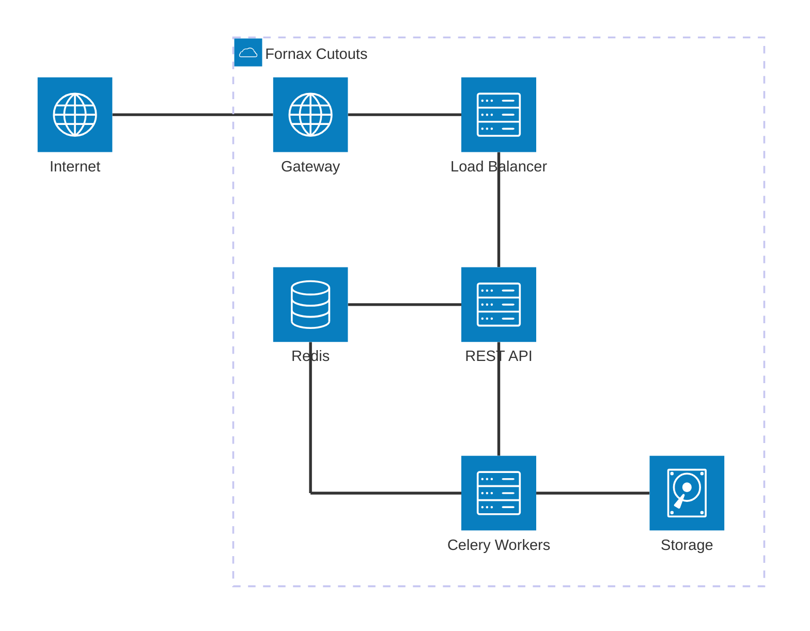
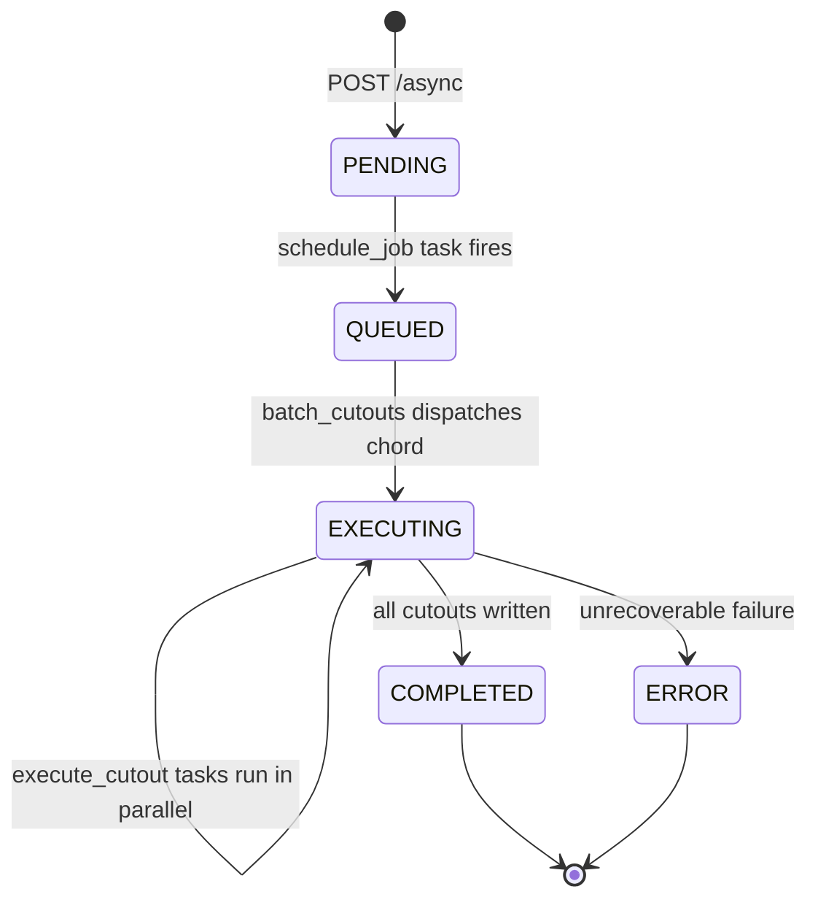

# Fornax Cutouts

Fornax Cutouts is a pluggable backend for generating asynchronous FITS image cutouts. The service is built on [FastAPI](https://fastapi.tiangolo.com/) and [Celery](https://docs.celeryq.dev/), and implements the [IVOA UWS](https://www.ivoa.net/documents/UWS/) (Universal Worker Service) standard for async job management. The Celery workers use [astrocut](https://astrocut.readthedocs.io/) (Astropy-based FITS cutouts and previews) to perform the actual cutouts within the [pipeline](celery-tasks.md).

The library is designed to be extended: you define mission-specific data sources, register them with the cutout registry, and the framework handles job queuing, worker dispatch, result storage, and API exposure automatically.

Currently the supported filetypes to generate cutouts for in this service are:

- `FITS`
  - Images

With future support to include:

- `ASDF`
  - Images
  - 2D Spectra

---

## Infrastructure Architecture

---

## Job Lifecycle

When a client submits an async cutout request, the job moves through the following states:

Individual cutout tasks within a job run in parallel via a Celery [chord](https://docs.celeryq.dev/en/stable/userguide/canvas.html#chords). Results are written to Parquet files in batches and are queryable via the results endpoints before the job finishes.

---

## Celery task pipeline

On submission, the API enqueues **`schedule_job`**, which validates parameters, materializes per-cutout **descriptors** in Redis, and starts **`batch_cutouts`**. Each `batch_cutouts` run builds a **chord**: parallel **`execute_cutout`** workers (queue `cutouts`) followed by a single **`write_results`** callback (queue `high_mem`) that appends to Parquet and either schedules the next batch or marks the job complete. See [Celery tasks and the async pipeline](celery-tasks.md) for task tables, queue notes, and dependency diagrams.

---

## Key Concepts

| Concept      | Description                                                         |
| ------------ | ------------------------------------------------------------------- |
| **Source**   | A mission-specific class that maps sky positions to FITS file paths |
| **Registry** | Discovers and holds all registered sources at startup               |
| **Job**      | A UWS-compliant async task tracked in Redis                         |
| **Worker**   | Celery process that executes cutouts and writes results             |
| **Storage**  | Local filesystem or S3 bucket where cutout files are written        |

---

## Quick Links

- [Getting Started](getting-started.md) — install and run locally
- [Configuration](configuration.md) — all environment variables
- [CLI Reference](cli.md) — entrypoint for the fornax-cutouts service (`api` & `worker`)
- [API Reference](api/index.md) — REST endpoints and Swagger UI
- [Building a Source](sources/building-a-source.md) — implement your first mission source
- [Celery tasks](celery-tasks.md) — service tasks and task architecture
