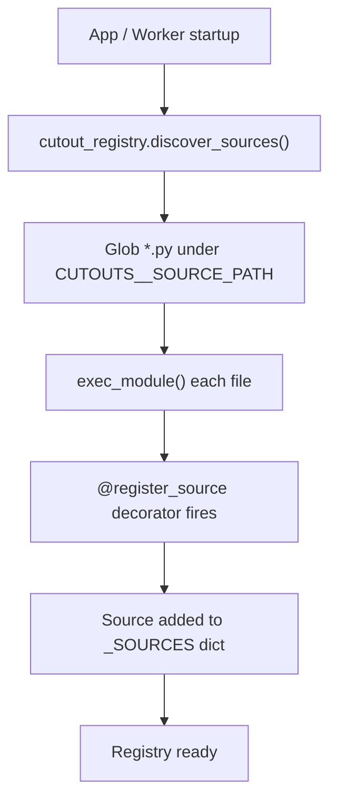
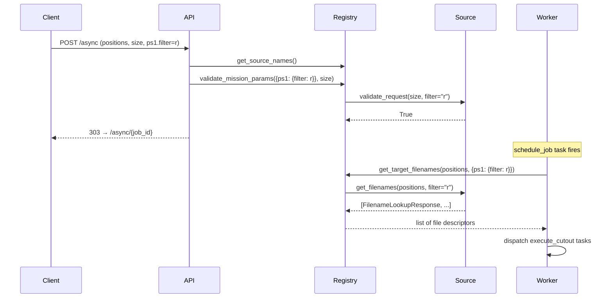

# Sources Overview

A **source** is a mission-specific plugin that tells Fornax Cutouts how to find the FITS files that cover a given sky position. The framework handles everything else: job queuing, worker dispatch, cutout generation, and result storage.

---

## The Registry

The `CutoutRegistry` is a singleton that holds all registered sources. It is created once at import time and shared across the API and all worker processes.

```python
from fornax_cutouts.sources import cutout_registry
```

### Discovery

At startup, the API and each worker call `discover_sources()`. This method globs all `*.py` files under `CUTOUTS__SOURCE_PATH` and executes each one. Any file that uses the `@cutout_registry.register_source(...)` decorator will register its source class automatically.



No imports or explicit registration calls are needed in your application code — just place your source file under the configured path.

### Registry Methods

| Method                                                                   | Description                                                                                                          |
| ------------------------------------------------------------------------ | -------------------------------------------------------------------------------------------------------------------- |
| `register_source(mission)`                                               | Decorator that registers a source class under the given mission key.                                                 |
| `discover_sources()`                                                     | Scans `CUTOUTS__SOURCE_PATH` and executes all `.py` files. Called at startup.                                        |
| `get_source_names()`                                                     | Returns a sorted list of all registered mission keys.                                                                |
| `get_mission(mission)`                                                   | Returns the `AbstractMissionSource` instance for a given key. Raises `ValueError` if not found.                      |
| `get_mission_metadata()`                                                 | Returns a dict mapping mission names to their `MissionMetadata`.                                                     |
| `validate_mission_params(mission_params, size)`                          | Validates request parameters against each mission's constraints. Returns a dict of `{mission: bool}`.                |
| `get_target_filenames(position, mission_params, size, include_metadata)` | Calls `get_filenames()` on each requested mission and returns the combined list of `FilenameLookupResponse` objects. |

---

## Source Lifecycle



---

## AbstractMissionSource

Every source must subclass `AbstractMissionSource` and provide:

1. A class-level `metadata` attribute of type `MissionMetadata`
2. An implementation of `get_filenames()`

```python
from fornax_cutouts.sources.base import AbstractMissionSource, MissionMetadata
from fornax_cutouts.models.cutouts import FilenameLookupResponse
from fornax_cutouts.models.base import Positions, TargetPosition

class MySource(AbstractMissionSource):
    metadata = MissionMetadata(
        name="my_mission",
        pixel_size=0.25,          # arcseconds per pixel
        max_cutout_size=3000,     # maximum allowed size in pixels
        filter=["g", "r", "i"],   # valid filter values
        survey=["main"],          # valid survey values
    )

    def get_filenames(
        self,
        positions: TargetPosition | Positions,
        filters: str | list[str],
        *args,
        include_metadata: bool = False,
        **kwargs,
    ) -> list[FilenameLookupResponse]:
        ...
```

### MissionMetadata Fields

| Field             | Type        | Description                                                                  |
| ----------------- | ----------- | ---------------------------------------------------------------------------- |
| `name`            | `str`       | Unique mission identifier. Must match the key used in `register_source()`.   |
| `pixel_size`      | `float`     | Pixel scale in arcseconds per pixel.                                         |
| `max_cutout_size` | `int`       | Maximum allowed cutout size in pixels. Requests exceeding this are rejected. |
| `filter`          | `list[str]` | Valid filter names for this mission.                                         |
| `survey`          | `list[str]` | Valid survey names for this mission.                                         |

`MissionMetadata` uses `extra = "allow"`, so you can add mission-specific fields beyond the standard ones.

### Built-in Validation

`AbstractMissionSource.validate_request()` is called by the registry before dispatching any job. It checks:

- `size > 0`
- `size <= metadata.max_cutout_size`
- `filter` value(s) are in `metadata.filter`
- `survey` value(s) are in `metadata.survey`

You can override `validate_request()` to add custom validation logic.

---

## FilenameLookupResponse

`get_filenames()` must return a list of `FilenameLookupResponse` objects. Each object describes a single FITS file that should be cut:

```python
from fornax_cutouts.models.cutouts import FilenameLookupResponse, FilenameWithMetadata

# Minimal response (no metadata)
FilenameLookupResponse(
    mission="my_mission",
    filename="s3://my-bucket/data/file.fits",
)

# With metadata (used when include_metadata=True)
FilenameLookupResponse(
    mission="my_mission",
    filename="s3://my-bucket/data/file.fits",
    metadata=FilenameWithMetadata(
        filter="r",
        survey="main",
        ra=83.8221,
        dec=-5.3911,
    ),
)
```

The `filename` field can be a local path or an `s3://` URI. The worker uses [fsspec](https://filesystem-spec.readthedocs.io/) to open both.

---

## Next Steps

See [Building a Source](building-a-source.md) for a complete step-by-step tutorial.
