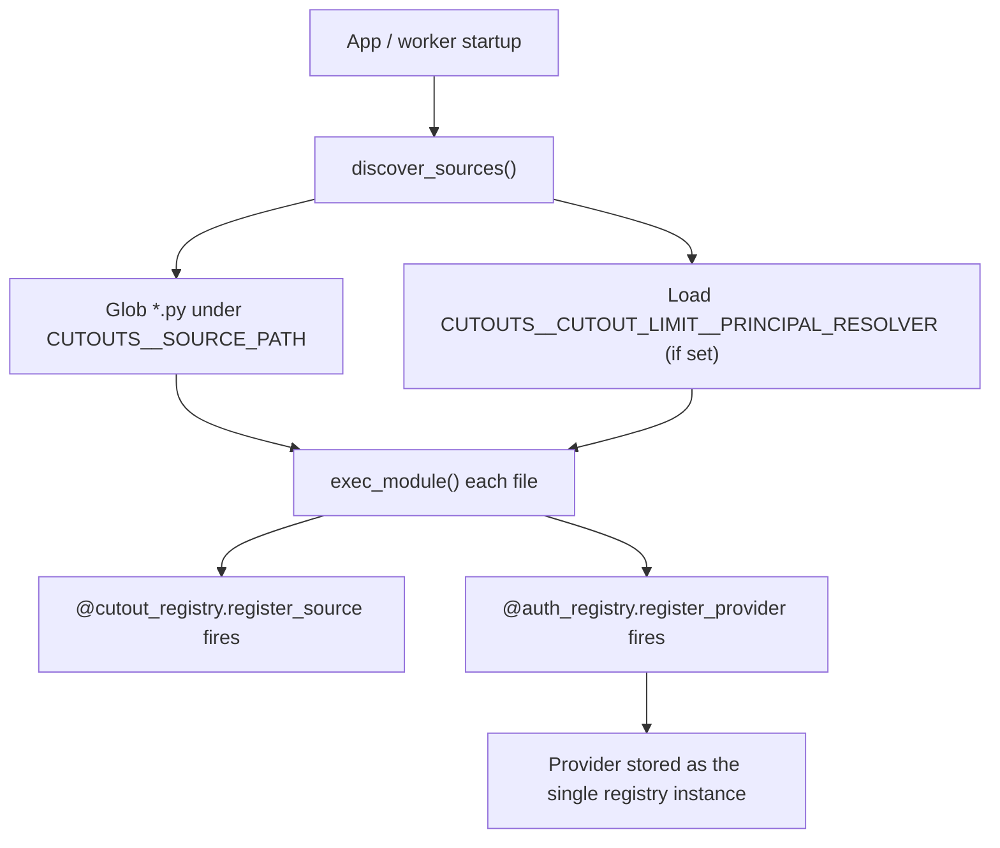
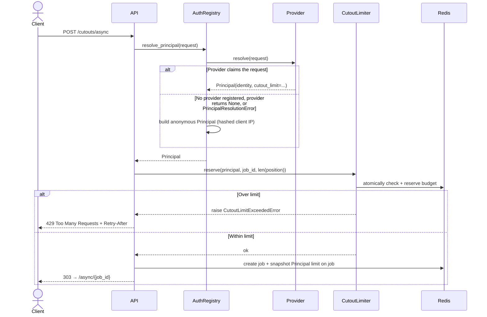
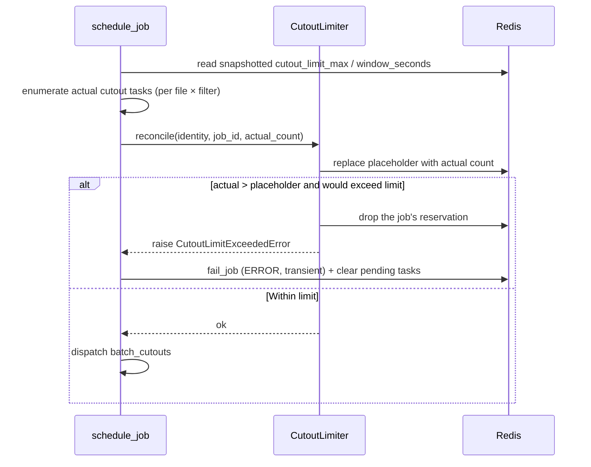

# Auth Providers Overview

`POST /cutouts/async` can limit how many cutouts a single identity requests within a rolling time window. The feature is **off by default** (`CUTOUTS__CUTOUT_LIMIT__ENABLED=false`); enable it and tune the settings below before limits take effect.

When enabled, anonymous requests are bucketed by a hashed client IP. An **auth provider** lets you plug in your own authentication/authorization logic — resolved from a request header, cookie, or token — to raise or remove that limit for known users.

---

## Configuration

Nested under `CUTOUTS__CUTOUT_LIMIT__`, plus one top-level setting for reverse-proxy trust.

| Environment Variable | Type | Default | Description |
| -------------------- | ---- | ------- | ----------- |
| `CUTOUTS__CUTOUT_LIMIT__ENABLED` | `bool` | `false` | Master switch. When `false`, `CutoutLimiter.reserve` / `reconcile` are no-ops and no 429s are returned. |
| `CUTOUTS__CUTOUT_LIMIT__ANON_CUTOUT_LIMIT` | `int` | `10` | Rolling-window cutout budget for anonymous (IP-derived) principals. |
| `CUTOUTS__CUTOUT_LIMIT__WINDOW_SECONDS` | `int` | `60` | Rolling window length in seconds. Overridable per principal via `Principal.window_seconds`. |
| `CUTOUTS__CUTOUT_LIMIT__PRINCIPAL_RESOLVER` | `path` | — | Optional path to a `.py` file or directory of auth provider modules, loaded in addition to `CUTOUTS__SOURCE_PATH`. |
| `CUTOUTS__NUM_TRUSTED_PROXIES` | `int` | `0` | Number of trusted reverse proxies in front of the API. Used when deriving the client IP from `X-Forwarded-For` (see [Anonymous principals](#anonymous-principals)). |

See [Configuration](../configuration.md) for all other service settings.

---

## Anonymous principals

When no auth provider is registered, the provider returns `None`, or resolution fails in a controlled way (see below), the registry builds an anonymous `Principal`:

- **Identity**: first 32 hex chars of `SHA-256(client_ip)`, or the literal bucket `unknown` when no IP can be determined.
- **Budget**: `CUTOUTS__CUTOUT_LIMIT__ANON_CUTOUT_LIMIT` (only enforced when cutout limiting is enabled).
- **`is_anonymous`**: `true`.

Client IP is resolved by `client_ip_from_request()`:

1. **`X-Forwarded-For`**: split on commas and take the entry at index `-(num_trusted_proxies + 1)` — the rightmost client IP after stripping trusted proxy hops appended at the end of the list. This prevents clients from spoofing their IP by prepending values to `X-Forwarded-For`.
2. **`X-Real-IP`**: used when `X-Forwarded-For` is absent.
3. **TCP peer address**: `request.client.host` as a last resort.

Set `CUTOUTS__NUM_TRUSTED_PROXIES` to the number of proxies you control between the internet and the API (for example `1` behind a single load balancer).

---

## The Registry

The `AuthRegistry` is a singleton that holds at most one registered auth provider. It is created once at import time and shared across the API process.

```python
from fornax_cutouts.auth import auth_registry
```

### Discovery

Auth providers are discovered by the same `discover_sources()` call that loads [mission sources](../sources/overview.md) at startup. Decorate a class with `@auth_registry.register_provider` and put it either under `CUTOUTS__SOURCE_PATH` alongside the mission sources, or in a dedicated location pointed at by `CUTOUTS__CUTOUT_LIMIT__PRINCIPAL_RESOLVER` (a single `.py` file or a directory that is globbed recursively). A file that lives under both paths is executed only once.



A `CUTOUTS__CUTOUT_LIMIT__PRINCIPAL_RESOLVER` path that does not exist is logged as a warning and skipped; the service starts and falls back to anonymous principals.

### Registry Methods

| Method                            | Description                                                                                                  |
| ---------------------------------- | -------------------------------------------------------------------------------------------------------------- |
| `register_provider`                | Decorator that instantiates and registers the sole auth provider. Raises `RuntimeError` if one is already registered. |
| `resolve_principal(request)`       | FastAPI dependency. Consults the registered provider and returns its `Principal` when non-`None`. Falls back to an IP-derived anonymous `Principal` when no provider is registered, the provider returns `None`, or it raises `PrincipalResolutionError`. Other exceptions propagate. |

---

## Request Flow (API)



At submission time the limiter reserves `len(position)` as a **placeholder** — the number of sky positions in the request, not the eventual per-file cutout count. This gives immediate feedback (a `429`) before the worker runs, but the placeholder is replaced during reconcile (see below).

The `Principal`'s `identity`, `cutout_limit`, and `window_seconds` are snapshotted on the job at creation, since the worker has no HTTP request to re-resolve auth against:

| Redis key | Description |
| --------- | ----------- |
| `jobs:{job_id}:cutout_limit_identity` | Identity string used for limiter bucketing |
| `jobs:{job_id}:cutout_limit_max` | Snapshotted `cutout_limit` (`int`); omitted when unlimited |
| `jobs:{job_id}:cutout_limit_window_seconds` | Snapshotted `window_seconds`; omitted when the config default applies |

Per-identity rolling-window state lives under `{redis_prefix}:cutout_limit:{identity}:events` (ZSET) and `:counts` (HASH). See `CutoutLimitKeys` in `fornax_cutouts/jobs/redis.py`.

---

## Worker Reconcile Flow

Once `schedule_job` resolves the actual source files for each position, it reconciles the placeholder reservation to the true cutout count.



Key behaviors:

- **Decrease** (actual < placeholder): always admitted; frees budget for the identity.
- **Increase** (actual > placeholder): re-checks the identity's current usage against the snapshotted limit before admitting. If it would exceed the limit, the increase is rejected, pending tasks are discarded, and the job is failed with `ExecutionPhase.ERROR` and a `transient` error summary — the client can retry after the window rolls. The rejected job's reservation is refunded rather than held for the rest of the window, since the job never runs.
- **Unlimited** (`cutout_limit=None`): no recheck on reconcile; the placeholder is simply updated to the actual count.

---

## AbstractAuthProvider

Every provider must subclass `AbstractAuthProvider` and provide:

1. A class-level `name` attribute, used as the registry key
2. An implementation of `async resolve(request) -> Principal | None`

```python
from starlette.requests import Request
from fornax_cutouts.auth import AbstractAuthProvider, Principal


class MyAuthProvider(AbstractAuthProvider):
    name = "my_auth"

    async def resolve(self, request: Request) -> Principal | None:
        ...
```

Return `None` when the provider doesn't recognize the request (e.g. no auth header present) — this lets the registry fall back to the anonymous default rather than treating the request as an error.

Raise `PrincipalResolutionError` when the request clearly targets your provider but resolution fails (e.g. identity backend unreachable). The registry logs a warning and falls back to the anonymous limit instead of returning HTTP 500. Any other exception propagates to FastAPI as an unhandled error.

### Principal Fields

| Field            | Type          | Description                                                                                     |
| ----------------- | ------------- | --------------------------------------------------------------------------------------------- |
| `identity`        | `str`         | Opaque key the cutout limiter buckets requests by. Should not be reversible to raw PII.         |
| `is_anonymous`     | `bool`        | Whether this identity is the IP-derived anonymous fallback. Defaults to `False`.                |
| `cutout_limit`     | `int \| None` | Maximum cutouts per window for this identity. `None` means **unlimited** (no budget enforced).  |
| `window_seconds`   | `int \| None` | Overrides `CUTOUTS__CUTOUT_LIMIT__WINDOW_SECONDS` for this identity. `None` uses the config default. |
| `extras`           | `dict`        | Free-form metadata for your own use (e.g. plan tier). Not used by the framework.                |

A provider fully controls the budget through `cutout_limit`: return a higher number to raise it, or `None` to remove it entirely.

---

## Next Steps

See [Building an Auth Provider](building-a-provider.md) for a complete step-by-step tutorial.
